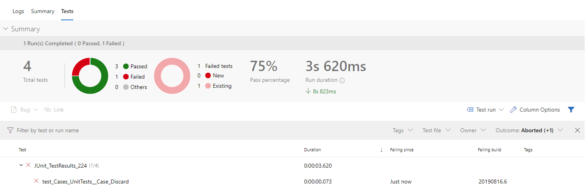
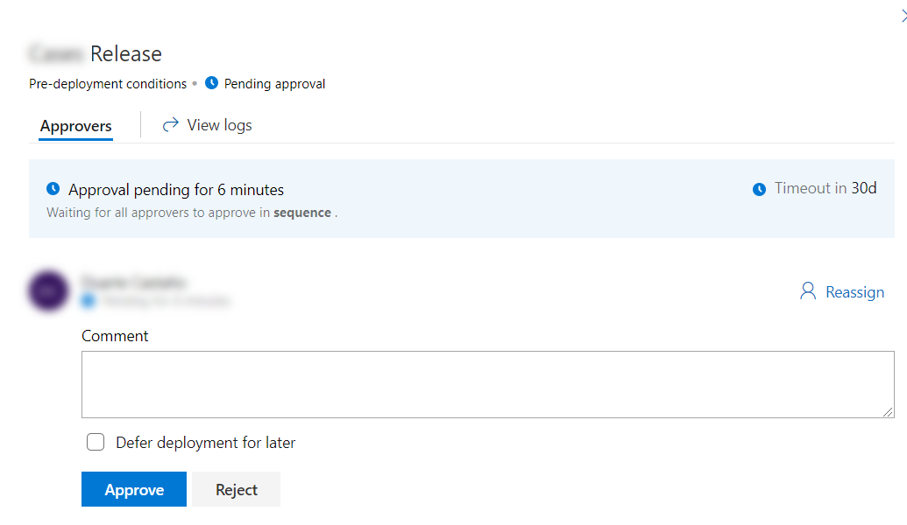

This guide provides a step-by-step description of how to implement a [recommended continuous delivery pipeline](https://success.outsystems.com/Documentation/Development_FAQs/How_to_build_an_OutSystems_continuous_delivery_pipeline) for OutSystems applications by leveraging the [LifeTime Deployment API](https://success.outsystems.com/Documentation/11/Reference/OutSystems_APIs/LifeTime_Deployment_API_v2) along with [Azure DevOps](https://azure.microsoft.com/en-us/services/devops/).

## Azure pipelines release flow

The role of a "deployment pipeline" is to ensure that code and infrastructure are always in a deployable state, and that all code checked in to trunk can be safely deployed into production.

The goal of the **Build Pipeline** is to provide everyone in the value stream, especially developers, the fastest possible feedback if a release candidate has taken them out of a deployable state. This could be a change to the code, to any of the environments, to the automated tests, or even to the pipeline infrastructure.

The Build Pipeline also stores information about which tests were performed on which build and what the test results were. In combination with the information from the version control history, we can quickly determine what caused the deployment pipeline to break and, likely, how to fix the error.

On the other hand, the **Release Pipeline** serves as the "push-button" device mentioned before, where all the necessary actions for successfully deploying to production a release candidate that has gone through the Build Pipeline are carried out.

> **Note**
>
> Most of the workload throughout the pipeline is performed by calling a set of functions from the [outsystems-pipeline](https://pypi.org/project/outsystems-pipeline/) Python package, distributed by OutSystems on the Python Package Index (PyPI) repository.

### Build Pipeline anatomy

The Build Pipeline is comprised of **4 sequential stages**, each one performing one or more actions as described in the following table:

| Stage | Actions performed |
|-------|-------------------|
| Install Dependencies | Install required Python dependencies for running pipeline activities. |
| Deploy to REG | Fetch the latest versions (tags) in DEV for the configured Applications and deploy them to REG environment. |
| Run Regression | Generate Python script for running BDD test scenarios using unittest module.  Run unit test suite and publish test results report. |
| Deploy to ACC | Deploy the latest versions (tags) for the configured Applications (excluding test apps) from REG to ACC environment. |

By leveraging the test-execution REST API, the pipeline is able to run tests written with the BDD Framework in the list of configured test applications. The outcome of this action is presented as a JUnit test report that seamlessly integrates with the Azure DevOps UI, as shown in the following picture:

> **Note**
>
> To learn more about running tests written with the BDD Framework using the test-execution REST API, please check [this article](https://www.outsystems.com/blog/posts/automate-bddframework-testing/).

Whenever **Run Regression** fails, the ongoing pipeline run is marked as failed and all subsequents stages are skipped, thus preventing a release candidate version to proceed further down the pipeline. The pipeline test report will also display which tests failed and why, for easier troubleshooting of the regression error. 

### Release Pipeline anatomy

The release pipeline is comprised of **3 sequential stages**, each one performing one or more actions as described in the following table:

| Stage | Actions performed |
|-------|-------------------|
| Deploy to ACC | Deploy the latest versions (tags) for the configured Applications (excluding test apps) from REG to ACC environment.  Wait for input from an authorized user to accept changes and proceed until production. |
| Deploy Dry-Run | Deploy the latest versions (tags) for the configured Applications from ACC to PRE environment. |
| Deploy Production | If the dry-run is successful, immediately trigger the deployment to PRD of the latest versions (tags) for the configured Applications. |

Whenever the pipeline reaches **Accept Changes** after the successful deploy on ACC, Azure Pipelines halts the pipeline execution until an authorized user makes the decision to accept (or reject) the release candidate version and proceed until production without further human intervention.

