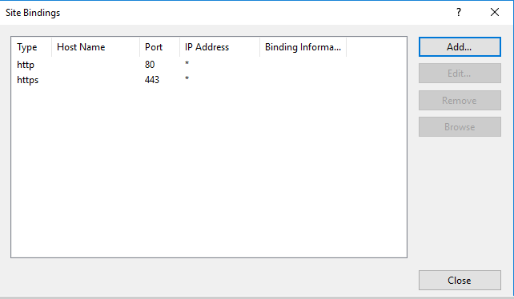
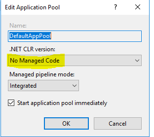

# How to install Jenkins

## Introduction

The following guide provides a step-by-step description of how to do a basic install of Jenkins in order to use it as an automation server.

Please refer to the [official documentation](https://jenkins.io/doc/book/installing/) to familiarize yourself with Jenkins and the installation process, if you want more in-depth knowledge.

## General architecture

## System requirements

This are the following system requirements we used internally to run our Jenkins server. You can adapt it to your environment to match the number of deployments you intend to run.

### Operating Systems

- Windows Server 2016
- Ubuntu 18.04 LTS

### Virtual Machine

- **CPU:** 4 vCPU
- **Memory:** 16 GB
- **Disk:**
  - *Root disk:* 50 GB
  - *Data disk:* 100 GB

### AWS

- **Instance Type:** t2.xlarge
- **Disk:**
  - *Root disk:* 50 GB
  - *Data disk:* 100 GB

### Azure

- **Instance Type:** Standard_D4_v3
- **Disk:**
  - *Root disk:* 100 GB
  - *Data disk:* 100 GB

## Networking

You need to open communication on the following ports / hosts:

- Jenkins -> LifeTime (HTTP, port 80) [only needed if you don't use HTTPS]
- Jenkins -> LifeTime (HTTPS, port 443)
- Your network -> Jenkins (HTTP / HTTPS, port 80, 443)

## Jenkins installation

### Windows

Download Jenkins [here](https://jenkins.io/download/). We use LTS versions of Jenkins, to provide a more stable environment. Version used was Jenkins 2.x.

Run the installer and follow the instructions. Use the Data disk as target for the installation.

### Linux

**Optional:** It's advised to use the Data disk for the Jenkins Home. Make sure the volume is formated and mounted automatically on boot. After this, make sure there's a folder inside the disk and that the owner is the `jenkins` user.

~~~~bash
# Format the second disk as ext4. Note: your volume name may be different!!
sudo mkfs.ext4 /dev/xvdb

# Make a directory for the mountpoint
sudo mkdir /data

# Get the block device ID. Copy the line for the data volume (e.g. xvdb)
sudo blkid

# The output should be similar to this:
#/dev/xvda1: LABEL="cloudimg-rootfs" UUID="a35c0336-90dc-4445-a988-b60872c987a7" TYPE="ext4" PARTUUID="9820e40e-01"
#/dev/loop0: TYPE="squashfs"
#/dev/loop1: TYPE="squashfs"
#/dev/xvdb: UUID="3c55800d-d84e-4032-a473-988f453ad61e" TYPE="ext4"  <<< this is the UUID we want

# Edit the Fstab to mount the disk on boot
sudo cp /etc/fstab /etc/fstab.orig
sudo vi /etc/fstab

# Add a line with the new volume
# Example:
# UUID=3c55800d-d84e-4032-a473-988f453ad61e       /data   ext4    defaults,nofail 0       2

# Test the mount point
sudo mount -a

# See the block devices
sudo lsblk -o NAME,FSTYPE,SIZE,MOUNTPOINT,LABEL
~~~~

To install Jenkins you need to run the following commands:

~~~~bash
wget -q -O - https://pkg.jenkins.io/debian-stable/jenkins.io.key | sudo apt-key add -

sudo sh -c 'echo "deb https://pkg.jenkins.io/debian-stable binary/" >> /etc/apt/sources.list.d/jenkins.list'

sudo apt update
sudo apt install -y jenkins
~~~~

To change the home directory do:

~~~~bash
# Edit the defaults for Jenkins
sudo vi /etc/default/jenkins

# Locate JENKINS_HOME (around line 23) and change it to your mount point/dir
JENKINS_HOME=/data/jenkins

# Restart jenkins
sudo systemctl restart jenkins
~~~~

## Jenkins configuration

### Reverse proxy and HTTPS

This step is optional. If you want to have Jenkins being accessible through HTTPS, you'll need to configure a reverse proxy with a certificate. The certificate generation for the hostname is left to you. Next we will describe how to install the reverse proxy on the Jenkins machine.

#### Windows - IIS

The configuration for the proxy was adapted from [here](https://wiki.jenkins.io/display/JENKINS/Running+Jenkins+behind+IIS).

##### Requirements

- IIS 7.0 or greater
  - IIS 8.5 or greater if you want [Certificate Rebind](https://docs.microsoft.com/en-us/iis/get-started/whats-new-in-iis-85/certificate-rebind-in-iis85)
- [URL Rewrite 2.1](https://www.iis.net/downloads/microsoft/url-rewrite) or greater
  - As the [article](https://blogs.iis.net/iisteam/url-rewrite-v2-1) explains, it introduces a feature flag to turn off the default non-compliant-RFC3986 behavior. Which is what we want.
- [Application Request Routing](https://www.iis.net/downloads/microsoft/application-request-routing) 3.0 or greater

Install IIS role on the server, adding the HTTP Redirection *(Under Common HTTP Features)* and WebSocket Protocol *(Under Application Development)*

Install URL Rewrite and Application Request Routing. You should have downloaded earlier.

In the Internet Information Services (IIS) Manager, click on the *\<hostname>* server. Go to **Application Request Routing Cache** and, in the Actions panel, click on **Server Proxy Settings...**. Enable the proxy and disable the reverse rewrite host in the response header. Apply the configs.

Configure the SSL Bindings by going to *\<hostname>* server, click Sites and select **Default Web Site**. On the Actions panel, under Edit Site, click on **Bindings...**. Add the HTTPS port with the certificate you previously installed.

Click ok. You should see both HTTP and HTTPS bindings:

Open the Jenkins configuration page (<http://jenkins-hostname/configure>) and change the Jenkins URL to <https://jenkins-hostname/> if you didn't do it during the installation.

Go to **Configure Global Security** and enable **Enable proxy compatibility** if you have already enabled **Prevent Cross Site Request Forgery exploits**.

Go to Manage (<https://jenkins-hostname/manage>) and you'll see a banner **"It appears that your reverse proxy set up is broken."** as expected.

On IIS Manager, go to **Application Pools** then edit **DefaultAppPool** so that the .NET CLR version is **No Managed Code** (Right-click, select **Basic Setttings...** and change it):

Go to Sites, Default Web Site, Request Filtering. In the Actions panel choose **Edit Feature Settings...** and turn on **Allow double escaping**:

Go to Sites, Default Web Site, Configuration Editor and change the Section to **system.webServer/rewrite/rules**:

Change **useOriginalURLEncoding** to *False* (if you don't see it, you forgot to install URL Rewrite 2.1):

And that should be it. You can now use the https to access Jenkins.

#### Linux - Nginx

To install Nginx run `sudo apt install -y nginx`. Once it finishes installing, you will need to configure the site configuration for Jenkins. Next we will detail how to create a site configuration:

~~~~bash
cd /etc/nginx/sites-available
sudo touch jenkins
cd ../sites-enabled
sudo ln -s ../sites-available/jenkins jenkins
sudo rm default ../site-available/default
~~~~

This will create the Jenkins site configuration and the soft link to enable that configuration. It will also delete Nginx's default configuration. Next, add the following configuration to the site configuration:

`sudo vi jenkins`

~~~~bash
upstream app_server {
    server  127.0.0.1:8080  fail_timeout=0;
}

# HTTP server configuration
#
server {
    server_name <DNS_NAME> www.<DNS_NAME>;
    listen 80;
    return 301 https://$server_name$request_uri;
}

# HTTPS server configuration
#
server {
    server_name <DNS_NAME> www.<DNS_NAME>;

    listen 443 ssl;

    # SSL configuration
    #
    ssl_certificate /etc/nginx/ssl/server.crt;
    ssl_certificate_key     /etc/nginx/ssl/server.key;

    # Log configuration
    #
    access_log      /var/log/nginx/jenkins.access.log;
    error_log       /var/log/nginx/jenkins.error.log;

    # Proxy configuration
    location / {
        include /etc/nginx/proxy_params;
        proxy_pass      http://app_server;
        proxy_read_timeout      90s;
        proxy_redirect  http://localhost:8080   https://$server_name;
    }
}
~~~~

Replace `<DNS_NAME>` with you hostname of your Jenkins (e.g. example.net).

Run `sudo nginx -t` to test if the configuration. If it returns the following output it means the configuration is correct:

~~~~bash
nginx: the configuration file /etc/nginx/nginx.conf syntax is ok
nginx: configuration file /etc/nginx/nginx.conf test is successful
~~~~

**Note:** It's assumed that you generated a server.key (without passphrase) and server.crt with the private key and certificate (respectively) on the `ssl` folder inside Nginx (you might have to create it too). If you have your cryptographic material somewhere else, point it to the corret directory / file. If you don't want to use a key without passphrase, look up on how to use a [ssl_password_file](https://nginx.org/en/docs/http/ngx_http_ssl_module.html#ssl_password_file).

**Extra:** To generate a server key from a `.pfx`, you can do:

~~~~bash
# Extract the private key (you will be prompted to insert the password and a new passphrase)
openssl pkcs12 -in <yourfile.pfx> -nocerts -out <keyfile-encrypted.key>

# Either run this command to remove the passphrase or use a ssl_password_file
openssl rsa -in <keyfile-encrypted.key> -out <keyfile-decrypted.key>

# Extract the certificate
openssl pkcs12 -in <yourfile.pfx> -clcerts -nokeys -out <certificate.crt>
~~~~

You will also need to make sure Jenkins is not being accessed without passing through the Nginx Proxy. To do that, you need to change the Listen Address on Jenkins.

~~~~bash
sudo  vi /etc/default/jenkins
~~~~

Locate the line containing JENKINS_ARGS. It should be the last line of the file. Change it's value to this:

`JENKINS_ARGS="--webroot=/var/cache/$NAME/war --httpListenAddress=127.0.0.1 --httpPort=$HTTP_PORT"`

Restart Nginx and Jenkins to refresh the configurations:

~~~~bash
sudo systemctl restart nginx
sudo systemctl restart jenkins
~~~~

If you didn't set up the hostname in the installation, you have to do it now. Log in to Jenkins and go to **Manage Jenkins** > **Configure System** > **Jenkins Location**. Set the **Jenkins URL** with the new URL you set up on Nginx. Remember to use HTTPS to access Jenkins.

### Plugins & Extra software

To install plugins, just type the name on the **Available Plugins**, under **Manage Jenkins** > **Manage Plugins**

#### Jenkins standard plugins

- BlueOcean: <https://wiki.jenkins.io/display/JENKINS/Blue+Ocean+Plugin>
- Build Authorization Token Root: <https://wiki.jenkins.io/display/JENKINS/Build+Token+Root+Plugin>
- JUnit: <https://wiki.jenkins.io/display/JENKINS/JUnit+Plugin>
- Pyenv Pipeline: <https://wiki.jenkins.io/display/JENKINS/Pyenv+Pipeline+Plugin>

#### Software

- Git:
  - Windows: <https://git-scm.com/download/win>
  - Linux: should be installed by default, if not use the default package repos
- Python 3.X:
  - Windows: (tested with 3.7.1) <https://www.python.org/downloads/release/python-371/>
  - Linux:
    - Python 3.X should be already installed. By default Ubuntu comes with Python 3.6.X
- Pip:
  - Windows: [install guide](https://pip.pypa.io/en/stable/installing/)
  - Linux: run:

    ~~~~bash
    sudo apt install -y python3-pip
    ~~~~

Python on Windows:

- Don't forget to install it to **all users** and add it to the Windows PATH.
- Reboot the machine to reload the PATH variables.
- Test Python with CMD:
  - `python -V` should return something like `Python 3.7.1`
- If it doesn't work (and returns an error saying python command is not recognized), you'll need to add it [manually](https://geek-university.com/python/add-python-to-the-windows-path/) to the PATH and reboot the machine.

Python on Linux:

- Careful not to override the default system Python (usually is 2.X), since it will break your package manager.
- When using Python, refer to Python3 and Pip3 in your Jenkinsfile.